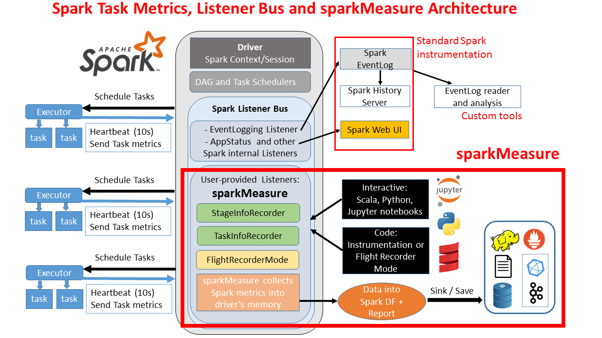

# sparkMeasure


[](https://maven-badges.herokuapp.com/maven-central/ch.cern.sparkmeasure/spark-measure_2.11)

### SparkMeasure is a tool for performance troubleshooting of Apache Spark jobs
SparkMeasure simplifies the collection and analysis of Spark performance metrics.  
Use sparkMeasure for troubleshooting **interactive and batch** Spark workloads.  
Use it also to collect metrics for long-term retention or as part of a **CI/CD** pipeline.  
SparkMeasure is also intended as a working example of how to use Spark Listeners for collecting Spark task metrics data.
 * Main author and contact: 
   * Luca.Canali@cern.ch + credits to Viktor.Khristenko@cern.ch + thanks to PR contributors
 * For Spark 2.x and 3.x
   * Tested on Spark 2.4 and 3.0
   * Spark 2.3 -> should also be OK
   * Spark 2.1 and 2.2 -> use sparkMeasure version 0.16 

### Getting started with sparkMeasure
 * Note: sparkMeasure is available on [Maven Central](https://mvnrepository.com/artifact/ch.cern.sparkmeasure/spark-measure)
 * Spark 3.0.x and 2.4.x with scala 2.12:
   - Scala: `bin/spark-shell --packages ch.cern.sparkmeasure:spark-measure_2.12:0.17`
   - Python: `bin/pyspark --packages ch.cern.sparkmeasure:spark-measure_2.12:0.17`
      - note: `pip install sparkmeasure` to get the Python wrapper API. 
 * Spark 2.x with Scala 2.11:
   - Scala: `bin/spark-shell --packages ch.cern.sparkmeasure:spark-measure_2.11:0.17`
   - Python: `bin/pyspark --packages ch.cern.sparkmeasure:spark-measure_2.11:0.17`
     - note: `pip install sparkmeasure` to get the Python wrapper API. 
 * Bleeding edge: build sparkMeasure jar using sbt: `sbt +package` and use `--jars`
   with the jar just built instead of using `--packages`.
   * Note: find the latest jars already built as artifacts in the [GitHub actions](https://github.com/LucaCanali/sparkMeasure/actions)

- [ Scala notebook on Databricks](https://databricks-prod-cloudfront.cloud.databricks.com/public/4027ec902e239c93eaaa8714f173bcfc/2061385495597958/2729765977711377/442806354506758/latest.html)  

- [ Python notebook on Databricks](https://databricks-prod-cloudfront.cloud.databricks.com/public/4027ec902e239c93eaaa8714f173bcfc/2061385495597958/3856830937265976/442806354506758/latest.html)  

- [ Jupyter notebook on Google Colab Research](https://colab.research.google.com/github/LucaCanali/sparkMeasure/blob/master/examples/SparkMeasure_Jupyter_Colab_Example.ipynb)

- [ Jupyter notebook hosted on Microsoft Azure Notebooks](https://notebooks.azure.com/LucaCanali/projects/sparkmeasure/html/SparkMeasure_Jupyter_Azure_Example.ipynb)

- [ Local Python/Jupyter Notebook](examples/SparkMeasure_Jupyter_Python_getting_started.ipynb)
  
- CLI: spark-shell and PySpark
  ```
  # Scala CLI, Spark 3.0
  bin/spark-shell --packages ch.cern.sparkmeasure:spark-measure_2.12:0.17

  val stageMetrics = ch.cern.sparkmeasure.StageMetrics(spark)
  stageMetrics.runAndMeasure(spark.sql("select count(*) from range(1000) cross join range(1000) cross join range(1000)").show())
  ```
  ```
  # Python CLI, Spark 3.0
  pip install sparkmeasure
  bin/pyspark --packages ch.cern.sparkmeasure:spark-measure_2.12:0.16

  from sparkmeasure import StageMetrics
  stagemetrics = StageMetrics(spark)
  stagemetrics.runandmeasure(locals(), 'spark.sql("select count(*) from range(1000) cross join range(1000) cross join range(100)").show()')
  ```
The output should look like this:
```
Scheduling mode = FIFO
Spark Context default degree of parallelism = 8
Aggregated Spark stage metrics:
numStages => 3
numTasks => 17
elapsedTime => 13520 (14 s)
stageDuration => 13411 (13 s)
executorRunTime => 100020 (1.7 min)
executorCpuTime => 98899 (1.6 min)
executorDeserializeTime => 4358 (4 s)
executorDeserializeCpuTime => 1887 (2 s)
resultSerializationTime => 2 (2 ms)
jvmGCTime => 56 (56 ms)
shuffleFetchWaitTime => 0 (0 ms)
shuffleWriteTime => 11 (11 ms)
resultSize => 19955 (19.0 KB)
diskBytesSpilled => 0 (0 Bytes)
memoryBytesSpilled => 0 (0 Bytes)
peakExecutionMemory => 0
recordsRead => 2000
bytesRead => 0 (0 Bytes)
recordsWritten => 0
bytesWritten => 0 (0 Bytes)
shuffleRecordsRead => 8
shuffleTotalBlocksFetched => 8
shuffleLocalBlocksFetched => 8
shuffleRemoteBlocksFetched => 0
shuffleTotalBytesRead => 472 (472 Bytes)
shuffleLocalBytesRead => 472 (472 Bytes)
shuffleRemoteBytesRead => 0 (0 Bytes)
shuffleRemoteBytesReadToDisk => 0 (0 Bytes)
shuffleBytesWritten => 472 (472 Bytes)
shuffleRecordsWritten => 8
```
- CLI: spark-shell, measure workload metrics aggregating from raw task metrics
  ```
  # Scala CLI, Spark 3.0
  bin/spark-shell --packages ch.cern.sparkmeasure:spark-measure_2.12:0.17

  val taskMetrics = ch.cern.sparkmeasure.TaskMetrics(spark)
  taskMetrics.runAndMeasure(spark.sql("select count(*) from range(1000) cross join range(1000) cross join range(1000)").show())
  ```

### One tool for different use cases, links to documentation and examples
  * **Interactive mode**: use sparkMeasure to collect and analyze Spark workload metrics real-time when
 working with shell or notebook environments, as `spark-shell` (Scala), `PySpark` (Python) and/or
from `jupyter-notebook`. Works with Python and Scala kernels.
    - **[Scala shell and notebooks](docs/Scala_shell_and_notebooks.md)**
    - **[PySpark and Jupyter notebooks](docs/Python_shell_and_Jupyter.md)**
 * **Code instrumentation**: instrument your code with the sparkMeasure API, for collecting, saving,
 and analyzing Spark workload metrics data, at your leisure.
    - **[Instrument Scala code](docs/Instrument_Scala_code.md)**
    - **[Instrument Python code](docs/Instrument_Python_code.md)**
 * **"Flight Recorder" mode**: SparkMeasure will collect metrics transparently,
 without any need for you to change your code. Metrics can be saved to a file
 (locally or to a Hadoop-compliant filesystem),
 or you can opt to write metrics in near-realtime to an InfluxDB instance.
    - **[Flight Recorder mode with file output](docs/Flight_recorder_mode.md)**
    - **[Flight Recorder mode with DB write output](docs/Flight_recorder_DBwrite.md)**
 * Additional info:
   - Presentations at Spark Summit:
     - [Performance Troubleshooting Using Apache Spark Metrics](https://databricks.com/session_eu19/performance-troubleshooting-using-apache-spark-metrics)
     - [Apache Spark Performance Troubleshooting at Scale, Challenges, Tools, and Methodologies](https://spark-summit.org/eu-2017/events/apache-spark-performance-troubleshooting-at-scale-challenges-tools-and-methodologies/)
   - Blogs:
     - [2018: SparkMeasure, a tool for performance troubleshooting of Apache Spark workloads](https://db-blog.web.cern.ch/blog/luca-canali/2018-08-sparkmeasure-tool-performance-troubleshooting-apache-spark-workloads),
     - [2017 blog post](http://db-blog.web.cern.ch/blog/luca-canali/2017-03-measuring-apache-spark-workload-metrics-performance-troubleshooting)
  - [TODO list and known issues](docs/TODO_and_issues.md)

### Architecture diagram  


### Main concepts underlying sparkMeasure  
* The tool is based on the Spark Listener interface. Listeners transport Spark executor 
  [Task Metrics](https://github.com/LucaCanali/Miscellaneous/blob/master/Spark_Notes/Spark_TaskMetrics.md)
  data from the executor to the driver.
  They are a standard part of Spark instrumentation, used by the Spark Web UI and History Server for example.     
* Metrics can be collected using sparkMeasure at the granularity of stage completion and/or task completion 
 (configurable)
* Metrics are flattened and collected into local memory structures in the driver (ListBuffer of a custom case class).   
* Spark DataFrame and SQL are used to further process metrics data for example to generate reports.  
* Metrics data and reports can be saved for offline analysis.
* SparkMeasure in flight recorder mode with InfluxDB sink, does not buffer the metrics in the driver memory,
it writes directly to InfluxDB.

### FAQ:  
  - Why measuring performance with workload metrics instrumentation rather than just using time?
    - Measuring elapsed time, treats your workload as "a black box" and most often does not allow you
     to understand the root cause of the performance. 
     With workload metrics you can (attempt to) go further in understanding and root cause analysis,
     bottleneck identification, resource usage measurement. 

  - What are Apache Spark tasks metrics and what can I use them for?
     - Apache Spark measures several details of each task execution, including run time, CPU time,
     information on garbage collection time, shuffle metrics and on task I/O. 
     See also Spark documentation for a description of the 
     [Spark Task Metrics](https://spark.apache.org/docs/latest/monitoring.html#executor-task-metrics)

  - How is sparkMeasure different from Web UI/Spark History Server and EventLog?
     - sparkMeasure uses the same ListenerBus infrastructure used to collect data for the Web UI and Spark EventLog.
       - Spark collects metrics and other execution details and exposes them via the Web UI.
       - Notably Task execution metrics are also available through the [REST API](https://spark.apache.org/docs/latest/monitoring.html#rest-api)
       - In addition Spark writes all details of the task execution in the EventLog file 
       (see config of `spark.eventlog.enabled` and `spark.eventLog.dir`)
       - The EventLog is used by the Spark History server + other tools and programs can read and parse
        the EventLog file(s) for workload analysis and performance troubleshooting, see a [proof-of-concept example of reading the EventLog with Spark SQL](https://github.com/LucaCanali/Miscellaneous/blob/master/Spark_Notes/Spark_EventLog.md)  
     - There are key differences that motivate this development: 
        - sparkMeasure can collect data at the stage completion-level, which is more lightweight than measuring
        all the tasks, in case you only need to compute aggregated performance metrics. When needed, 
        sparkMeasure can also collect data at the task granularity level.
        - sparkMeasure has an API that makes it simple to add instrumention/performance measurements
         in notebooks and application code. 
        - sparkMeasure collects data in a flat structure, which makes it natural to use Spark SQL for 
        workload data processing, which provides a simple and powerful interface
        - limitations: sparkMeasure does not collect all the data available in the EventLog, sparkMeasure
        buffers data in the driver memory, [see also the TODO and issues doc](docs/TODO_and_issues.md)

  - What are known limitations and gotchas?
     - The currently available Spark task metrics can give you precious quantitative information on 
     resources used by the executors, however there do not allow to fully perform time-based analysis of
     the workload performance, notably they do not expose the time spent doing I/O or network traffic.
     -  Metrics are collected on the driver, which can be quickly become a bottleneck. This is true
     in general for ListenerBus instrumentation, in addition sparkMeasure in the current version buffers
     all data in the driver memory. The notable exception is the Fligh recorder mode with InfluxDB sink,
     in this case metrics are directly sent to InfluxDB.
     - Task metrics values are collected by sparkMeasure only for successfully executed tasks. Note that 
     resources used by failed tasks are not collected in the current version. The notable exception is
     with the Flight recorder mode with InfluxDBSink.
     - Task metrics are collected by Spark executors running on the JVM, resources utilized outside the
      JVM are currently not directly accounted for (notably the resources used when running Python code
      inside the python.daemon in the case of PySpark).

  - When should I use stage metrics and when should I use task metrics?
     - Use stage metrics whenever possible as they are much more lightweight. Collect metrics at
     the task granularity if you need the extra information, for example if you want to study 
     effects of skew, long tails and task stragglers.

  - What are accumulables?
     - Metrics are first collected into accumulators that are sent from the executors to the driver.
     Many metrics of interest are exposed via [[TaskMetrics]] others are only available in StageInfo/TaskInfo
     accumulables (notably SQL Metrics, such as "scan time")

  - How can I save/sink the collected metrics?
     - You can print metrics data and reports to standard output or save them to files, using
      a locally mounted filesystem or an Hadoop compliant filesystem (including HDFS).
     Additionally you can sink metrics to external systems (such as Prometheus. 
     The Flight Recorder mode can sink has the ther sinks like InfluxDB or Kafka may be implemented in future versions). 

  - How can I process metrics data?
     - You can use Spark to read the saved metrics data and perform further post-processing and analysis.
     See the also [Notes on metrics analysis](docs/Notes_on_metrics_analysis.md).

  - How can I contribute to sparkMeasure?
    - SparkMeasure has already profited from users submitting PR contributions. Additional contributions are welcome. 
    See the [TODO_and_issues list](docs/TODO_and_issues.md) for a list of known issues and ideas on what 
    you can contribute.  
